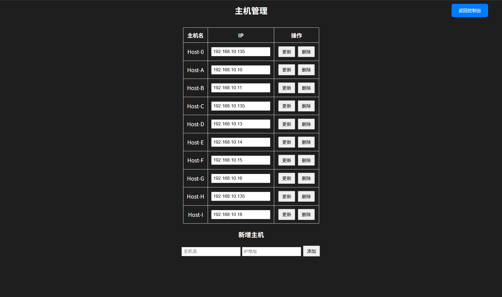

# docker_ansible_dashboard

docker部署数据大屏期末作业

# About 本项目

本项目基于 **Flask** 框架开发，结合 **Ansible** 和 **Docker** 实现了一个简单易用的主机状态监控与管理平台。
用户可以通过前端界面，方便地进行主机信息的添加、删除、修改与查询操作。

### 主要功能

* 基于 Web 的主机管理界面，支持动态增删改查
* 自动检测并修复 Docker 网络冲突，保障容器网络稳定
* 支持批量 SSH 密钥分发与配置，简化远程管理
* 镜像上传至阿里云容器镜像仓库，方便云端部署

### 技术栈

* 后端：Python3 + Flask + Ansible
* 前端：HTML + CSS + JavaScript
* 容器：Docker + Shell 脚本自动化管理
  当然可以！根据你提供的项目结构，我为你生成一个初步的 `README.md` 文件草稿，包含 About 项、项目结构说明、主要功能简述、使用方式、Docker 部署等内容。你可以根据实际情况进一步补充。

---

## 📌 About

本项目是一个基于 **Flask + Ansible** 实现的主机状态监控与管理平台。它通过 Web 前端提供图形化操作界面，支持对主机列表的增删改查操作，并结合 Docker 自动化管理网络配置（如网段冲突检测与自动修复）功能。适用于对多主机环境的统一运维管理需求。

---

## 📁 项目结构

```
.
├── app/                          # Flask 应用主目录
│   ├── app.py                    # 主程序入口
│   ├── hosts                     # 主机信息文件（存储格式支持自定义）
│   ├── requirements.txt          # Python依赖项
│   ├── start.sh                  # 启动脚本（用于容器入口）
│   ├── static/                   # 静态资源
│   │   ├── script.js             # 前端逻辑脚本
│   │   └── style.css             # 样式表
│   └── templates/                # Jinja2 HTML 模板
│       ├── dashboard.html        # 仪表盘页面
│       ├── hosts.html            # 主机管理页面
│       └── login.html            # 登录页面
├── Dockerfile                    # 构建 Flask 服务的 Docker 镜像
├── docker_net_config.sh          # Docker 网络配置检测与修复脚本
├── hosts_info.txt                # 示例主机信息（用于测试）
├── push_to_aliyun_interactive.sh # 阿里云镜像仓库交互式上传脚本
└── docker_build__setup_and_configure_hosts_ssh.sh    # 构建镜像并启动容器，批量设置 SSH 登录脚本
```

---

## 🚀 功能特色

* ✅ 基于 Flask 实现的 Web 前端管理界面
* ✅ 支持主机信息增删改查
* ✅ 集成 Ansible 实现远程命令执行与状态采集
* ✅ 自动检测 Docker 网络冲突，动态分配可用网段
* ✅ 自动修复网络并重启容器
* ✅ 支持将镜像上传至阿里云容器镜像仓库
* ✅ 自动构建镜像与启动容器
* ✅ 批量 SSH 配置与管理


## 🛠️ 使用方法

### 1. 克隆项目

```bash
https://github.com/aroytime/docker_ansible_dashboard.git
cd docker_ansible_dashboard
```

### 2. 执行脚本构建镜像并配置ssh

```bash
bash docker_build__setup_and_configure_hosts_ssh.sh
```

> Docker 构建部署
>
> ```bash
> docker build -t host-monitor .
> docker run -d  -p 5000:5000 --name dashboard host-monitor
> ```

### 3.访问界面

> 浏览器访问
>
> http://{宿主机IP}:5000
>
> 用户名：admin
>
> 密码：123456


### 4.管理主机

> 可在线对主机镜像增加，修改和删除


## 🐳 Docker 网络管理脚本使用

```bash
# 自动检测冲突、修复并重启指定容器/服务
bash docker_net_config.sh
```

---

## 🔐 SSH 批量配置

```bash
bash docker_build__setup_and_configure_hosts_ssh.sh
# 支持设置主机 SSH 密钥连接，批量推送 ~/.ssh/id_rsa.pub
```

---

## 📤 推送镜像到阿里云

```bash
bash push_to_aliyun_interactive.sh
# 交互式输入镜像名、版本号和仓库地址
```

